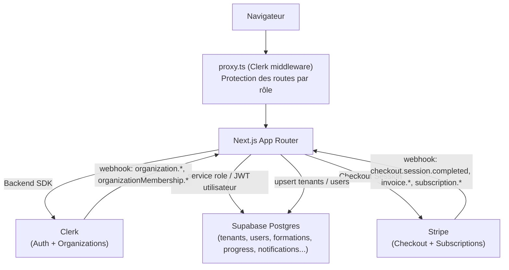

# Architecture — Ahead LMS Platform

Plateforme LMS multi-tenant : Ahead (super-admin) fournit un catalogue de formations IA à des entreprises clientes (tenants), qui gèrent leurs propres apprenants.

## Stack

- **Next.js 16** (App Router, Turbopack)
- **Clerk** — authentification + gestion des Organizations (= tenants)
- **Supabase** (Postgres) — base de données, avec Row Level Security
- **Stripe** — abonnements SaaS (Checkout + Webhooks)
- **OpenAI API** (`gpt-5.6-luna`) — génération de formation par IA (super-admin, V1)

## Schéma général

## Modèle multi-tenant

Une **Clerk Organization = un tenant** (entreprise cliente). La table `tenants` est synchronisée automatiquement par le webhook Clerk (`app/api/webhooks/clerk/route.ts`) :

- `organization.created` / `organization.updated` → upsert dans `tenants` (par `clerk_org_id`)
- `organizationMembership.created` / `organizationMembership.updated` → upsert dans `users` (rôle mappé depuis le rôle Clerk via `lib/clerk/index.ts`)

### Rôles (`types/database.ts`)

| Rôle | Portée | Description |
|---|---|---|
| `super_admin` | Global (Ahead) | Gère le catalogue de formations et les entreprises clientes |
| `admin_tenant` | Un tenant | Administrateur de l'entreprise cliente, gère l'abonnement et les apprenants |
| `tuteur` | Un tenant | Accès similaire à `admin_tenant` sur `/org`, sans facturation |
| `formateur` | Un tenant | Rôle réservé (peu utilisé actuellement) |
| `apprenant` | Un tenant | Suit les formations activées par son entreprise |

Le rôle Clerk générique `org:admin` est mappé vers `admin_tenant`, et tout le reste vers `apprenant` (voir `lib/clerk/index.ts` — les rôles personnalisés Clerk ne sont pas encore configurés).

## Routing (`app/`)

Le middleware `proxy.ts` redirige selon le rôle stocké en base et protège chaque groupe de routes :

- **`(dashboard)`**
  - `/admin/*` — réservé `super_admin` (catalogue IA transverse, gestion des tenants)
  - `/apprenant/*` — réservé `apprenant` (formations, leçons, progression)
- **`(org)`**
  - `/org/*` — réservé `admin_tenant` + `tuteur` (tableau de bord, catalogue activé, apprenants)
- **Public** — `/sign-in`, `/sign-up`, `/pricing`, `/api/webhooks/*`

## Accès aux données Supabase (`lib/supabase/`)

Deux clients selon le contexte :

- **`createServiceRoleSupabaseClient()`** — bypass total de la RLS, clé service role. Utilisé dans la quasi-totalité des routes/pages serveur actuelles (source de vérité applicative).
- **`createUserSupabaseClient()`** / **`createBrowserSupabaseClient()`** — passent le JWT Clerk, soumis aux policies RLS (`supabase/migrations/*rls*.sql`). Prévu pour les requêtes directement initiées côté utilisateur.

## Abonnements & Stripe

L'état d'abonnement vit directement sur `tenants` : `subscription_status`, `subscription_plan`, `stripe_customer_id`, `stripe_subscription_id`.

- **Checkout** — `POST /api/stripe/checkout` crée une Stripe Checkout Session (mode `subscription`), avec `metadata.tenant_id` pour retrouver le tenant dans le webhook.
- **Webhook** — `POST /api/webhooks/stripe` écoute `checkout.session.completed` (active l'abonnement + déclenche les notifications), `invoice.payment_failed` (passe en `past_due`), `customer.subscription.deleted` (annule).
- **Gate d'accès** — `lib/subscription.ts` → `hasActiveSubscription(tenantId)` :
  - bloque `/org/catalogue` et `/org/apprenants` (+ leurs routes API) si le tenant n'a pas d'abonnement actif
  - limite l'apprenant aux 2 premières leçons de chaque formation (`FREE_PREVIEW_LESSON_COUNT`), avec un mur "Accès limité" au-delà
  - un popup non-bloquant (`SubscriptionModal`) apparaît sur `/org` pour inciter à s'abonner sans bloquer l'accès immédiat

## Notifications in-app

Table `notifications` (`recipient_user_id`, `sender_user_id`, `type`, `message`, `is_read`) + cloche (`components/shared/NotificationBell.tsx`, poll 30s) affichée dans tous les layouts.

Deux déclencheurs (`lib/notifications.ts`) :

- **`subscription_request`** — un apprenant bloqué par le mur "Accès limité" prévient les `admin_tenant` de son entreprise (cooldown 24h pour éviter le spam)
- **`subscription_activated`** — déclenché par le webhook Stripe : informe les apprenants du tenant (accès débloqué) et tous les `super_admin` (nouveau client payant)

## Onboarding d'une nouvelle entreprise cliente

1. Le super-admin crée l'entreprise depuis `/admin/tenants` (`POST /api/admin/tenants`)
2. Le backend Clerk crée l'Organization **sans** ajouter le super-admin comme membre (`createdBy` volontairement omis, pour ne pas corrompre son propre rôle via le webhook de sync)
3. Une invitation Clerk (`role: org:admin`) est envoyée par email à l'administrateur de l'entreprise
4. Le webhook Clerk crée automatiquement la ligne `tenants` (`organization.created`)
5. Quand l'admin accepte l'invitation, le webhook crée sa ligne `users` (`organizationMembership.created`, rôle `admin_tenant`)

## Catalogue de formations

- Formations créées par Ahead (`tenant_id IS NULL`, catalogue transverse) via `/admin/catalog`
- Un `admin_tenant` active des formations pour son entreprise via `/org/catalogue` → table `tenant_formations`
- Les apprenants ne voient que les formations activées par leur tenant (`app/(dashboard)/apprenant/page.tsx`)
- Cover de formation : `formations.thumbnail_url` si renseigné, sinon dégradé + icône générés automatiquement par hash déterministe de l'id (`lib/formationAccent.ts`) — même formation = même rendu à chaque affichage

## Suivi de progression & gamification

- `/apprenant/progression` — vue d'ensemble apprenant : complétion globale, progression par formation, badges
- Badges calculés en direct depuis `progress`/`quiz_results` (pas de moteur de règles) : `lib/badges.ts` (`computeBadges`, `detectAndPersistNewBadges`)
- Table `user_badges` sert uniquement à détecter un déblocage "nouveau" pour déclencher un toast (`BadgeUnlockToasts.tsx`), pas de source de vérité pour l'état des badges
- Points crédités via `total_points` sur `users`, niveau = `floor(points / 500) + 1`

## Génération de formation par IA (Super-admin uniquement, V1)

Réservée au `super_admin` en V1 — les `admin_tenant` n'y ont pas accès (prévu en V2 avec leurs propres documents).

Flow : `/admin/catalog/new` propose un choix Manuel / IA. En mode IA, `POST /api/formations/generate` reçoit un PDF ou `.docx` et exécute :

1. **Extraction de texte** (`lib/documentExtraction.ts`) — `unpdf` pour PDF, `mammoth` pour `.docx`. Document tronqué à 60 000 caractères si trop volumineux (pas de découpage/résumé progressif pour l'instant).
2. **Génération structurée** (`lib/ai/generateFormation.ts`) — appel à l'API Responses d'OpenAI avec sortie JSON strict contrainte par un schéma Zod (`lib/ai/contentBlocks.ts`). Le contenu de chaque leçon est une liste de blocs typés (`heading`, `paragraph`, `list`, `callout`, `comparison`, `feature_grid`, `highlight`). Règle métier forcée par validation : exactement une leçon `quiz` par module, en dernière position — retry automatique avec message de correction si la sortie du modèle est invalide.
3. **Sauvegarde** (`lib/ai/saveGeneratedFormation.ts`) — écrit dans les tables existantes (`formations`, `modules`, `lecons`, `quizzes`, `quiz_questions`). La formation est créée en **brouillon** (`is_published: false`) : le super-admin doit relire et publier explicitement depuis l'éditeur.
4. **Rendu** — une leçon avec `content_type = 'rich'` stocke ses blocs dans `lecons.content_blocks` (jsonb) et est affichée par `components/lessons/BlockRenderer.tsx` côté apprenant.

Point technique notable : `pdf-parse` (basé sur `pdfjs-dist`) a été abandonné après deux échecs en environnement Vercel Serverless — d'abord un chemin de worker relatif non résolu par le bundling Turbopack, puis un `ReferenceError: DOMMatrix is not defined` (pdfjs-dist attend des globals navigateur même pour de la simple extraction de texte). Remplacé par **`unpdf`**, qui embarque une build de PDF.js spécifiquement dépourvue de ces dépendances navigateur et sans worker externe — fonctionne nativement en Serverless, aucune configuration `serverExternalPackages` nécessaire.

Limite connue : l'éditeur manuel actuel ne permet pas de modifier le contenu (blocs) d'une leçon générée par IA — seulement ses métadonnées (titre, publication). Un éditeur de blocs dédié serait nécessaire pour ça.
