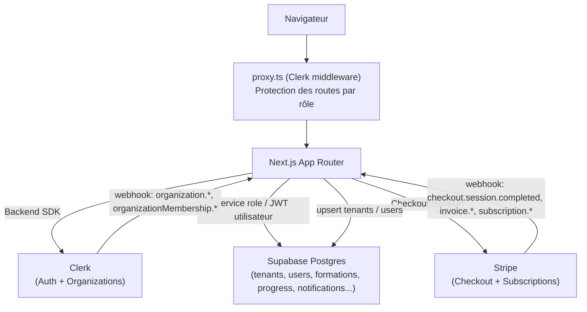

# Architecture — Ahead LMS Platform

Plateforme LMS multi-tenant : Ahead (super-admin) fournit un catalogue de formations IA à des entreprises clientes (tenants), qui gèrent leurs propres apprenants.

## Stack

- **Next.js 16** (App Router, Turbopack)
- **Clerk** — authentification + gestion des Organizations (= tenants)
- **Supabase** (Postgres) — base de données, avec Row Level Security
- **Stripe** — abonnements SaaS (Checkout + Webhooks)
- **OpenAI API** — génération de formation par IA (`OPENAI_MODEL_GENERATION`, défaut `gpt-6.1-sol`) et chat apprenant (`OPENAI_MODEL_CHAT`, défaut `gpt-6-luna`), voir `lib/openai/index.ts`

## Schéma général

```mermaid
flowchart TB
    Browser["Navigateur"]
    Middleware["proxy.ts (Clerk middleware)\nProtection des routes par rôle"]
    NextApp["Next.js App Router"]
    Clerk["Clerk\n(Auth + Organizations)"]
    Supabase["Supabase Postgres\n(tenants, users, formations, progress, notifications...)"]
    Stripe["Stripe\n(Checkout + Subscriptions)"]

    Browser --> Middleware --> NextApp
    NextApp -- "Backend SDK" --> Clerk
    NextApp -- "service role / JWT utilisateur" --> Supabase
    NextApp -- "Checkout Session" --> Stripe

    Clerk -- "webhook: organization.*, organizationMembership.*" --> NextApp
    Stripe -- "webhook: checkout.session.completed, invoice.*, subscription.*" --> NextApp
    NextApp -- "upsert tenants / users" --> Supabase
```

## Modèle multi-tenant

Une **Clerk Organization = un tenant** (entreprise cliente). La table `tenants` est synchronisée automatiquement par le webhook Clerk (`app/api/webhooks/clerk/route.ts`) :

- `organization.created` / `organization.updated` → upsert dans `tenants` (par `clerk_org_id`)
- `organizationMembership.created` / `organizationMembership.updated` → upsert dans `users` (rôle mappé depuis le rôle Clerk via `lib/clerk/index.ts`)

### Rôles (`types/database.ts`)

| Rôle | Portée | Description |
|---|---|---|
| `super_admin` | Global (Ahead) | Gère le catalogue de formations et les entreprises clientes |
| `admin_tenant` | Un tenant | Administrateur de l'entreprise cliente, gère l'abonnement et les apprenants |
| `tuteur` | Un tenant | Accès similaire à `admin_tenant` sur `/org`, sans facturation |
| `formateur` | Un tenant | Rôle réservé (peu utilisé actuellement) |
| `apprenant` | Un tenant | Suit les formations activées par son entreprise |

Le rôle Clerk générique `org:admin` est mappé vers `admin_tenant`, et tout le reste vers `apprenant` (voir `lib/clerk/index.ts` — les rôles personnalisés Clerk ne sont pas encore configurés).

## Routing (`app/`)

Le middleware `proxy.ts` redirige selon le rôle stocké en base et protège chaque groupe de routes :

- **`(dashboard)`**
  - `/admin/*` — réservé `super_admin` (catalogue IA transverse, gestion des tenants)
  - `/apprenant/*` — réservé `apprenant` (formations, leçons, progression)
- **`(org)`**
  - `/org/*` — réservé `admin_tenant` + `tuteur` (tableau de bord, catalogue activé, apprenants)
- **Public** — `/sign-in`, `/sign-up`, `/pricing`, `/api/webhooks/*`

## Accès aux données Supabase (`lib/supabase/`)

Deux clients selon le contexte :

- **`createServiceRoleSupabaseClient()`** — bypass total de la RLS, clé service role. Utilisé dans la quasi-totalité des routes/pages serveur actuelles (source de vérité applicative).
- **`createUserSupabaseClient()`** / **`createBrowserSupabaseClient()`** — passent le JWT Clerk, soumis aux policies RLS (`supabase/migrations/*rls*.sql`). Prévu pour les requêtes directement initiées côté utilisateur.

## Abonnements & Stripe

Limites par offre centralisées dans `lib/planLimits.ts` : formations IA par mois (`AI_FORMATIONS_PER_MONTH`, écrit sur le tenant par le webhook Stripe) et nombre d'apprenants (`LEARNER_LIMIT`, vérifié à l'invitation — inscrits + invitations Clerk en attente, `app/api/org/apprenants/invite/route.ts`).

L'état d'abonnement vit directement sur `tenants` : `subscription_status`, `subscription_plan`, `stripe_customer_id`, `stripe_subscription_id`.

- **Checkout** — `POST /api/stripe/checkout` crée une Stripe Checkout Session (mode `subscription`), avec `metadata.tenant_id` pour retrouver le tenant dans le webhook.
- **Webhook** — `POST /api/webhooks/stripe` écoute `checkout.session.completed` (active l'abonnement + déclenche les notifications), `invoice.payment_failed` (passe en `past_due`), `customer.subscription.deleted` (annule).
- **Gate d'accès** — `lib/subscription.ts` → `hasActiveSubscription(tenantId)` :
  - bloque `/org/catalogue` et `/org/apprenants` (+ leurs routes API) si le tenant n'a pas d'abonnement actif
  - limite l'apprenant aux 2 premières leçons de chaque formation (`FREE_PREVIEW_LESSON_COUNT`), avec un mur "Accès limité" au-delà
  - un popup non-bloquant (`SubscriptionModal`) apparaît sur `/org` pour inciter à s'abonner sans bloquer l'accès immédiat

## Notifications in-app

Table `notifications` (`recipient_user_id`, `sender_user_id`, `type`, `message`, `is_read`) + cloche (`components/shared/NotificationBell.tsx`, poll 30s) affichée dans tous les layouts.

Deux déclencheurs (`lib/notifications.ts`) :

- **`subscription_request`** — un apprenant bloqué par le mur "Accès limité" prévient les `admin_tenant` de son entreprise (cooldown 24h pour éviter le spam)
- **`subscription_activated`** — déclenché par le webhook Stripe : informe les apprenants du tenant (accès débloqué) et tous les `super_admin` (nouveau client payant)

## Onboarding d'une nouvelle entreprise cliente

Deux chemins possibles :

**A. Invitation par le super-admin**
1. Le super-admin crée l'entreprise depuis `/admin/tenants` (`POST /api/admin/tenants`)
2. Le backend Clerk crée l'Organization **sans** ajouter le super-admin comme membre (`createdBy` volontairement omis, pour ne pas corrompre son propre rôle via le webhook de sync)
3. Une invitation Clerk (`role: org:admin`) est envoyée par email à l'administrateur de l'entreprise
4. Le webhook Clerk crée automatiquement la ligne `tenants` (`organization.created`)
5. Quand l'admin accepte l'invitation, le webhook crée sa ligne `users` (`organizationMembership.created`, rôle `admin_tenant`)

**B. Auto-inscription de l'admin_tenant**
1. `/sign-up` (Clerk `<SignUp/>`) → redirection forcée vers `/create-organization` (`NEXT_PUBLIC_CLERK_SIGN_UP_FORCE_REDIRECT_URL`)
2. `/create-organization` (Clerk `<CreateOrganization/>`) crée l'Organization ; son créateur en devient automatiquement `org:admin`. L'écran d'invitation intégré de Clerk s'affiche ensuite automatiquement (email + rôle + "passer cette étape") — pas de page custom, juste `afterCreateOrganizationUrl="/"`
3. Le webhook Clerk crée `tenants` (`organization.created`) et `users` (`organizationMembership.created`, rôle `admin_tenant`) de la même façon qu'au chemin A
4. Retour sur `/` → `WaitForSync` attend la synchro webhook puis route vers `/org`

**Point important** : un `<SignUp/>` seul, sans passer par `/create-organization`, ne déclenche aucun webhook (aucune Organization créée/rejointe) — l'utilisateur reste bloqué sans ligne `users`. C'est pour ça que la redirection forcée post-signup est indispensable, et que `/sign-up` ne doit jamais être une impasse accessible sans ce second écran.

## Catalogue de formations

- Formations créées par Ahead (`tenant_id IS NULL`, catalogue transverse) via `/admin/catalog`
- Un `admin_tenant` active des formations pour son entreprise via `/org/catalogue` → table `tenant_formations`
- Les apprenants ne voient que les formations activées par leur tenant (`app/(dashboard)/apprenant/page.tsx`)
- Cover de formation : `formations.thumbnail_url` si renseigné, sinon dégradé + icône générés automatiquement par hash déterministe de l'id (`lib/formationAccent.ts`) — même formation = même rendu à chaque affichage

## Suivi de progression & gamification

- `/apprenant/progression` — vue d'ensemble apprenant : complétion globale, progression par formation, badges
- Badges calculés en direct depuis `progress`/`quiz_results` (pas de moteur de règles) : `lib/badges.ts` (`computeBadges`, `detectAndPersistNewBadges`)
- Table `user_badges` sert uniquement à détecter un déblocage "nouveau" pour déclencher un toast (`BadgeUnlockToasts.tsx`), pas de source de vérité pour l'état des badges
- Points crédités via `total_points` sur `users`, niveau = `floor(points / 500) + 1`

## Contenu riche des leçons

Une leçon avec `content_type = 'rich'` stocke ses blocs typés (`heading`, `paragraph`, `list`, `callout`, `comparison`, `feature_grid`, `highlight`… — schéma Zod dans `lib/ai/contentBlocks.ts`) dans `lecons.content_blocks` (jsonb). Ils sont affichés par `components/lessons/BlockRenderer.tsx` côté apprenant et éditables avec `components/lessons/BlockEditor.tsx`, aussi bien dans le flow de création par IA que dans l'éditeur admin (`/admin/catalog/[id]/edit`).

Point technique notable (extraction PDF) : `pdf-parse` (basé sur `pdfjs-dist`) a été abandonné après deux échecs en environnement Vercel Serverless — d'abord un chemin de worker relatif non résolu par le bundling Turbopack, puis un `ReferenceError: DOMMatrix is not defined` (pdfjs-dist attend des globals navigateur même pour de la simple extraction de texte). Remplacé par **`unpdf`**, qui embarque une build de PDF.js spécifiquement dépourvue de ces dépendances navigateur et sans worker externe — fonctionne nativement en Serverless, aucune configuration `serverExternalPackages` nécessaire.

> Historique : une première version (V1) réservée au super_admin générait une formation entière en un seul appel à partir d'un unique PDF/Word tronqué à 60 000 caractères (`POST /api/formations/generate`). Elle a été retirée au profit du flow complet ci-dessous, désormais commun au super_admin et aux admin_tenant.

## Pipeline RAG et génération de formation par IA (super_admin et admin_tenant)

Le même flow (documents source → cadrage → structure → génération leçon par leçon → publication) sert deux espaces :

- **`admin_tenant`** (`/org/formations/...`) — formation privée de son entreprise (`formations.tenant_id` = son tenant), soumise à l'offre Création/Entreprise et à un quota de **formations IA par mois** (`tenants.ai_generation_quota`, valeurs dans `lib/planLimits.ts`). Une formation est comptée une seule fois, à la première génération de sa structure (`consume_formation_ai`, migration `20261001000000_formation_ai_quota.sql`, `formations.ai_started_at`) ; ses leçons et régénérations sont ensuite incluses, dans la limite de `MAX_GENERATIONS_PER_FORMATION` (`formations.ai_generation_count`).
- **`super_admin`** (`/admin/catalog/...`) — formation du catalogue global Ahead (`tenant_id IS NULL`), sans abonnement ni quota. Une fois publiée, elle devient activable par chaque tenant ; une dernière étape propose une vidéo d'accompagnement (`/admin/catalog/[id]/video`) puis l'éditeur admin pour compléter description/niveau/durée.

Les écrans vivent une seule fois dans `components/authoring/` (paramètre `space: "org" | "admin"`, voir `components/authoring/space.ts`) ; les pages de `app/(org)/org/formations/[id]/*` et `app/(dashboard)/admin/catalog/[id]/*` ne font que les instancier. Les routes API sont communes (`/api/org/formations/[id]/...`, nom historique) : `requireFormationAuthor()` (`lib/api/require-formation-author.ts`) accepte les deux rôles et renvoie `tenantId` (null pour le super_admin), puis `assertOwnFormation(supabase, formationId, guard.tenantId)` compare `formations.tenant_id` à cette valeur — un super_admin n'atteint donc jamais la formation privée d'un tenant, et inversement. Les documents du catalogue sont stockés sous `catalogue/{knowledge_source_id}/{file_name}` (`knowledge_sources.tenant_id` null).

Le flow crée une formation à partir de **plusieurs documents source**, indexés dans un vrai pipeline RAG (Retrieval-Augmented Generation) : les documents sont découpés en fragments ("chunks"), vectorisés, puis recherchés par similarité au moment de la génération plutôt que renvoyés en entier au modèle.

```mermaid
flowchart TB
    A["Upload document ou URL\n(PDF, Word, PowerPoint, .txt, page web)\nPOST /api/org/formations/[id]/knowledge-sources"]
    B["Extraction du texte\nlib/documentExtraction.ts\nunpdf · mammoth · JSZip (pptx) · cheerio (web)"]
    C["Découpage en chunks\n~500 tokens, ~50 de chevauchement,\njamais au milieu d'une phrase — lib/chunking.ts"]
    D["Embedding Voyage AI\nvoyage-3, 1024 dimensions, inputType=document\nlib/embeddings.ts"]
    E[("Table chunks (pgvector)\nknowledge_source_id + formation_id")]

    A --> B --> C --> D --> E

    F["Proposition de structure\nlib/ai/generateStructureProposal.ts\nlit le texte complet, dans l'ordre (vue d'ensemble)"]
    G["Génération d'une leçon / d'un quiz\nlib/ai/generateLessonContent.ts\nrecherche ciblée top-K via searchChunks(…, \"document\")"]
    H["Validation de la leçon par le Formateur"]
    I["Ré-indexation du contenu validé\nlib/chunkLesson.ts"]
    J[("chunks : lesson_id\nremplace les chunks-document pour cette leçon")]

    E -.-> F
    E -.-> G
    F --> G --> H --> I --> J

    K["Question d'un apprenant\nPOST /api/agent/[formationId]"]
    L["Embedding de la question\ninputType=query"]
    M["match_chunks (RPC SQL, pgvector)\nfiltré par formation_id + chunks-leçon uniquement"]
    N["Seuil de pertinence ≥ 0.25\n(calibré empiriquement, voir le code)"]
    O["Réponse LLM ancrée dans le contexte\n+ citation des leçons sources"]

    E -.-> M
    J -.-> M
    K --> L --> M --> N --> O
```

### 1. Ingestion des documents (`knowledge_sources` → `chunks`)

- **Upload** — `POST /api/org/formations/[id]/knowledge-sources` accepte un fichier (PDF, `.docx`/`.doc`, `.pptx`/`.ppt`, `.txt`, 4 Mo max) ou une URL web, une ligne `knowledge_sources` par source (`ingestion_status` : `en_attente` → `en_cours` → `terminee`/`erreur`).
- **Extraction** (`lib/documentExtraction.ts`, `extractKnowledgeSourceText`) — `unpdf` (PDF), `mammoth` (Word), extraction manuelle via `JSZip` pour PowerPoint (un `.pptx` est une archive zip, texte lu directement dans les XML `ppt/slides/slideN.xml`), lecture brute pour `.txt`, `fetch` + `cheerio` pour une URL. **Limite connue** : l'extraction web n'exécute aucun JavaScript — un site en SPA (React/Vue rendu côté client) ne renvoie que le conteneur HTML vide, sans le contenu réel (confirmé en conditions réelles sur un cas client).
- **Découpage** (`lib/chunking.ts`, `chunkText`) — cible ~500 tokens par chunk avec ~50 tokens de chevauchement entre chunks consécutifs (pour ne pas perdre le contexte à la frontière), en respectant toujours les frontières de phrases (jamais coupées en deux). Comptage via `gpt-tokenizer` (BPE cl100k) — un ordre de grandeur, pas le tokenizer exact de Voyage AI.
- **Embedding** (`lib/embeddings.ts`) — Voyage AI, modèle `voyage-3`, 1024 dimensions, par batchs de 100 textes max. `inputType` distingue `"document"` (un chunk à indexer) de `"query"` (une question de recherche) — Voyage optimise différemment les deux représentations.
- **Stockage** (`lib/ingestChunks.ts`, `embedAndInsertChunks`) — une ligne par chunk dans la table `chunks` (colonne `embedding vector(1024)`, extension `pgvector`), avec `tenant_id`, `formation_id`, `knowledge_source_id`, et `metadata` (position, offsets, nombre de tokens).

### 2. Deux populations de chunks pour une même formation

La table `chunks` sert deux usages distincts pour une même formation, distingués par la colonne renseignée (`knowledge_source_id` XOR `lesson_id`) :

- **Chunks-document** (`knowledge_source_id` renseigné) — issus directement des documents uploadés. Utilisés **pendant la création**, de deux façons :
  - **Vue d'ensemble** (pas de recherche vectorielle) : `loadSourceDocumentsText` (`lib/sourceDocumentsText.ts`) reconstitue le texte complet des documents — documents dans leur ordre d'ajout, chunks dans leur ordre d'origine, chevauchements retirés. La proposition de structure (`generateStructureProposal`) lit ce texte entier (jusqu'à ~400 000 caractères, environ 150 pages). Le bouton « Décider pour moi » du cadrage lit une **fiche de synthèse** générée une fois à partir de ce même texte (`lib/sourcesSummary.ts`, table `formation_sources_summary`, régénérée si la liste des documents change, préparée dès l'ouverture du cadrage par `POST .../cadrage/summary`). À partir de cette synthèse, **un seul appel** propose les 7 champs du cadrage d'un coup (`suggestFullCadrage`, `POST .../cadrage/suggest`) ; il est lancé en arrière-plan dès l'ouverture, et le stepper préremplit ensuite chaque étape sans nouvel appel. Une nouvelle proposition n'est demandée que si le Formateur s'écarte d'une valeur proposée (elle reprend alors ses réponses et adapte les champs suivants). Une recherche top-K ne convient pas ici : un plan ou un cadrage doit couvrir tout le document, pas seulement les passages proches d'une requête.
  - **Recherche ciblée** : la génération d'une leçon ou d'un quiz (`generateLessonContent`/`generateLessonQuiz`) fait une recherche vectorielle limitée aux chunks-document (top-8 pour une leçon, top-12 pour un quiz — le quiz couvre aussi les leçons sœurs du module).
- **Chunks-leçon** (`lesson_id` renseigné) — générés à la **validation** d'une leçon (`lib/chunkLesson.ts`, `embedAndInsertLessonChunks`), à partir du contenu réel de la leçon (blocs aplatis en texte), pas du document source. Remplacent systématiquement les anciens chunks de cette leçon (delete puis insert) — y compris immédiatement après une régénération ou une édition manuelle, avant même la revalidation, pour ne jamais laisser le chat apprenant répondre avec un contenu périmé pendant qu'une leçon déjà publiée est retouchée.

Cette distinction existe parce que le contenu réellement montré à l'apprenant (les blocs de la leçon, potentiellement retouchés manuellement après génération) peut diverger du document source brut — le chat apprenant doit répondre à partir de ce que l'apprenant voit vraiment, pas du PDF d'origine.

### Autopilote

Bouton « Tout générer automatiquement » de l'étape Génération (`GenerationClient.tsx`) : génère dans l'ordre toutes les leçons et tous les quiz encore vides, deux à la fois (`AUTOPILOT_CONCURRENCY` — chaque leçon ne s'appuie que sur les documents source), en appelant la même route que le bouton manuel. Pause / reprise (la reprise repart des leçons encore vides), arrêt sur quota atteint, leçons en échec listées, écran maintenu allumé (Wake Lock) et avertissement à la fermeture de l'onglet. Rien n'est validé automatiquement : le Formateur relit et valide chaque leçon. La génération est pilotée par la page — elle s'arrête si l'onglet est fermé ou l'ordinateur en veille.

### Blocs image, vidéo et prompt

- **`image_text`** (image à gauche / à droite / pleine largeur + texte) et **`video`** (YouTube / Vimeo) : l'IA peut les proposer, mais ne fournit jamais le média — `image_url` / `url` sont forcés à `null` après génération (`withoutGeneratedMedia`, `lib/ai/generateLessonContent.ts`). Elle décrit l'image attendue (`image_description`) ou propose une recherche YouTube (`search_query`). Le Formateur ajoute ensuite l'image (`POST /api/org/formations/[id]/media` → bucket public `lesson-media`, chemin `{formation_id}/{uuid}.{ext}`, migration `20260930000003_lesson_media_bucket.sql`) ou choisit une vraie vidéo (`/api/admin/youtube/search`, ouvert aux deux rôles auteurs). Tant qu'un média manque, l'apprenant ne voit que le texte ; l'aperçu du Formateur (`BlockRenderer showPlaceholders`) et la barre latérale de l'étape Génération signalent les médias à ajouter. Les images d'une formation sont supprimées avec elle (`deleteLessonMedia`).
- **`prompt`** : prompt prêt à copier-coller par l'apprenant (bouton Copier), avec un conseil d'utilisation optionnel.

### Attentes de génération côté interface

- **Structure en streaming** — `POST .../structure/generate` répond en NDJSON (`delta` / `retry` / `done` / `error`, voir le commentaire de la route) ; `StreamingStructurePreview` relit le JSON partiel (bibliothèque `partial-json`) et affiche les modules au fil de leur écriture, avec un squelette clignotant avant le premier module (~6-9 s) et un en-tête de progression fixe « module X / N ». Mesuré sur un PDF de 60 pages : 13 modules affichés entre 9 s et 76 s, structure complète à ~80 s. La validation Zod et les nouvelles tentatives restent faites côté serveur, à la fin ; la structure est enregistrée même si le navigateur se déconnecte.
- **Autres attentes** (génération d'une leçon ~28 s, d'un quiz ~16 s, upload d'un document, fiche de synthèse du cadrage ~40 s) — `components/authoring/WaitingPanel.tsx` : étapes cochées selon un temps **estimé** (plafonné à 95 % tant que la réponse n'est pas arrivée) et extraits réels des documents qui défilent (`GET .../excerpts`, purement illustratifs).

### 3. Recherche vectorielle (`lib/searchChunks.ts` + fonction SQL `match_chunks`)

`searchChunks(query, formationId, topK, source)` embedde la requête (`inputType: "query"`) puis appelle la fonction Postgres `match_chunks` (migration `20260930000001_catalogue_ai_authoring.sql`), qui trie les chunks par similarité cosinus (opérateur pgvector `<=>`). `source` choisit la population de chunks : `"document"` pour la génération des leçons/quiz (elle doit s'appuyer sur les sources, pas sur des leçons déjà générées), `"lesson"` pour le chat apprenant (il répond à partir de ce que l'apprenant voit réellement). Côté isolation, la fonction filtre **uniquement par `formation_id`** — pas de re-vérification du tenant à ce niveau : l'accès à la formation précise doit déjà avoir été vérifié en amont par l'appelant (voir `isFormationAccessibleToTenant`/`authorizeAccess`). `formation_id` seul suffit puisqu'un chunk n'appartient jamais qu'à une seule formation.

### 4. Chat RAG apprenant (`app/api/agent/[formationId]/route.ts`)

Pipeline : vérification d'accès (rôle `apprenant`, formation publiée et accessible au tenant, apprenant inscrit) → `searchChunks` (top-5, chunks-leçon uniquement) → filtre de pertinence (similarité ≥ **0.25**, seuil calibré empiriquement sur des scores réels — voir le commentaire dans le code pour l'historique du calibrage) → si aucun chunk pertinent, le LLM répond honnêtement qu'il ne trouve pas l'information (jamais de réponse codée en dur, pour rester dans la langue de la question) → sinon, réponse construite uniquement à partir des extraits retrouvés, avec citation des leçons sources (titres résolus côté serveur, jamais laissés au LLM lui-même). Historique conservé dans `agent_messages` (question et réponse, avec les sources).

### Isolation multi-tenant du RAG

`chunks.tenant_id` est nullable (une formation du catalogue global a `tenant_id IS NULL`) — l'isolation réelle repose sur `formation_id`, combinée à la vérification d'accès à la formation faite **avant** tout appel RAG (double chemin déjà documenté : propriétaire direct via `formations.tenant_id`, ou catalogue global activé via `tenant_formations`).

### Ajouter un nouveau format de document supporté

Les 5 formats acceptés aujourd'hui (`pdf`, `word`, `ppt`, `texte`, `web`) suivent tous le même point d'entrée (`extractKnowledgeSourceText`, `lib/documentExtraction.ts`) — le reste du pipeline (découpage, embedding, stockage) est entièrement agnostique au format d'origine puisqu'il ne travaille que sur du texte brut déjà extrait. Ajouter un format se limite donc à 4 endroits :

1. **`lib/documentExtraction.ts`**
   - Ajouter la valeur au type `KnowledgeSourceFormat`.
   - Étendre `detectKnowledgeSourceFormat(filename)` pour reconnaître la/les nouvelle(s) extension(s).
   - Écrire une fonction `extractTextFromXxx(buffer)` qui renvoie le texte brut (voir `extractTextFromPptx` pour un exemple d'extraction "maison" sans dépendance lourde, ou `extractTextFromDocx` pour un exemple s'appuyant sur une lib dédiée) — toujours lever une `Error` explicite en cas de fichier corrompu/vide plutôt que renvoyer une chaîne vide silencieusement.
   - Ajouter le nouveau `case` dans le `switch` d'`extractKnowledgeSourceText`.
2. **Contrainte base de données** — le `CHECK` sur `knowledge_sources.format` (migration `20260812000001_knowledge_sources_and_storage.sql`) liste explicitement les valeurs autorisées : une nouvelle migration doit l'étendre (`ALTER TABLE ... DROP CONSTRAINT ... ADD CONSTRAINT ... CHECK (format IN (...))`), sans quoi l'insertion échouera même si le code applicatif accepte déjà le format.
3. **Upload côté client** (`components/authoring/sources/SourcesClient.tsx`) — ajouter la nouvelle extension à l'attribut `accept` de l'`<input type="file">`, et une entrée dans `FORMAT_LABEL` pour l'affichage du badge de format dans la liste des documents ajoutés.

Rien à toucher côté chunking (`lib/chunking.ts`), embeddings (`lib/embeddings.ts`) ou recherche (`lib/searchChunks.ts`) — ces étapes ne connaissent jamais le format d'origine du document.
